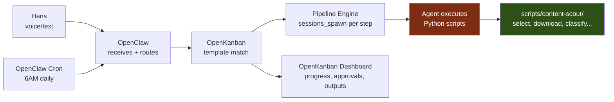

# Content Scout — Workflow Specification

**Version:** 1.3 (integrated into OpenKanban)  
**Date:** 2026-02-23  
**Status:** Ready to Build  
**Client:** Hans (OpenKanban)  
**Purpose:** Autonomous daily pipeline — a feature of OpenKanban — that monitors competitor YouTube channels for stock/options trading content, extracts visual analytics (graphs, charts, data), transcribes verbal analysis, annotates everything, stores to Notion + local files, and generates personalized content briefs for Hans.

**Analysis doc:** `CONTENT-SCOUT-ANALYSIS.md` (rationale for all changes from v1.0)

### Integration Model

Content Scout is **not a standalone program.** It's a workflow inside OpenKanban, orchestrated by OpenClaw:



- **OpenClaw cron** triggers the daily run
- **OpenKanban's workflow engine** manages the pipeline steps via `sessions_spawn`
- **Agents** execute Python scripts as tools (like they already call yt-dlp, ffmpeg, etc.)
- **OpenKanban dashboard** shows Hans pipeline progress, approvals, and outputs
- Python scripts, configs, and output all live inside `projects/openkanban/app/`

---

## Table of Contents

1. [Overview](#1-overview)
2. [User Stories](#2-user-stories)
3. [Architecture](#3-architecture)
4. [Pipeline Steps (Detailed)](#4-pipeline-steps-detailed)
5. [Python Scripts (Deterministic)](#5-python-scripts-deterministic)
6. [Data Models](#6-data-models)
7. [File & Directory Structure](#7-file--directory-structure)
8. [Notion Integration](#8-notion-integration)
9. [YouTube Integration](#9-youtube-integration)
10. [Visual Detection & Annotation](#10-visual-detection--annotation)
11. [Scheduling & Automation](#11-scheduling--automation)
12. [Channel Discovery](#12-channel-discovery)
13. [OpenKanban Template Definition](#13-openkanban-template-definition)
14. [Agent Profiles](#14-agent-profiles)
15. [Configuration](#15-configuration)
16. [Error Handling & Edge Cases](#16-error-handling--edge-cases)
17. [Security & Compliance](#17-security--compliance)
18. [Feedback & Iteration](#18-feedback--iteration)
19. [Future Enhancements](#19-future-enhancements)

---

## 1. Overview

### Problem

Hans runs a stock/options trading community. His content pipeline relies on staying current with competitor analysis, visual data (charts, graphs, options flow, sector heat maps), and market narratives. Currently this is manual — watching videos, screenshotting, noting insights. It doesn't scale.

### Solution

An autonomous daily pipeline ("Content Scout") that:
- Monitors a curated list of competitor YouTube channels
- Downloads the latest 3-5 videos per day (video-only — no audio stream needed for frames)
- Extracts frames at regular intervals + deduplicates
- Transcribes audio via Whisper for verbal context (levels, targets, thesis)
- Classifies and annotates each visual with AI, enriched by transcript segments
- Stores organized visuals + notes to Notion and local filesystem
- Generates a personalized daily content brief informed by Hans's active positions
- Periodically discovers new relevant channels for Hans to approve

### Key Principles

- **Deterministic where possible** — Python scripts handle everything that doesn't need intelligence
- **LLM only where it adds value** — classification, annotation, and brief generation
- **Autonomous by default** — runs daily without intervention
- **Human-in-the-loop where it matters** — Hans approves new channels, reviews content briefs
- **Quality over quantity** — better to surface 5 great visuals than 50 mediocre ones
- **Transcript-enriched** — verbal context makes every annotation 10x more useful
- **Position-aware** — the brief knows what Hans trades and prioritizes accordingly

### Script vs LLM Boundary

```mermaid
graph LR
    subgraph "🐍 Python Scripts (Deterministic)"
        A[Video Selection<br/>keyword match + scoring]
        B[Download<br/>yt-dlp wrapper]
        C[Frame Extraction<br/>ffmpeg + pHash dedup]
        D[Transcription<br/>Whisper API call]
        E[Transcript Windowing<br/>timestamp → text slice]
        F[Image Compression<br/>sharp/Pillow → WebP]
        G[File Storage<br/>directory + index.json]
        H[Notion Sync<br/>API client + formatting]
        I[Tag Indexing<br/>reverse index builder]
        J[Processing Log<br/>dedup + stats]
        K[Channel Staleness<br/>rolling avg + threshold]
        L[Cost Tracking<br/>API call accounting]
    end

    subgraph "🧠 LLM (Intelligence Required)"
        M[Visual Classification<br/>is this a chart?]
        N[Frame Annotation<br/>what does it show?]
        O[Content Brief<br/>synthesis + personalization]
        P[Channel Relevance Scoring<br/>content quality assessment]
    end

    style A fill:#2d5016,color:#fff
    style B fill:#2d5016,color:#fff
    style C fill:#2d5016,color:#fff
    style D fill:#2d5016,color:#fff
    style E fill:#2d5016,color:#fff
    style F fill:#2d5016,color:#fff
    style G fill:#2d5016,color:#fff
    style H fill:#2d5016,color:#fff
    style I fill:#2d5016,color:#fff
    style J fill:#2d5016,color:#fff
    style K fill:#2d5016,color:#fff
    style L fill:#2d5016,color:#fff
    style M fill:#7c2d12,color:#fff
    style N fill:#7c2d12,color:#fff
    style O fill:#7c2d12,color:#fff
    style P fill:#7c2d12,color:#fff
```



**Impact:** 12 deterministic operations handled by Python scripts vs. 4 that genuinely need LLMs. This means ~75% of the pipeline is fast, cheap, and predictable. LLM calls are isolated to where intelligence actually matters.

---

## 2. User Stories

### Core

| ID | Story | Priority |
|----|-------|----------|
| US-1 | As Hans, I want to receive a daily digest of competitor chart visuals with annotations so I can stay current without watching every video | **P0** |
| US-2 | As Hans, I want each visual annotated with what it shows, key data points, verbal context from the presenter, and trading relevance | **P0** |
| US-3 | As Hans, I want visuals saved to Notion with searchable tags so I can find them later when creating content | **P0** |
| US-4 | As Hans, I want a daily content brief that's aware of my active positions and identifies themes + angles for my own content | **P0** |
| US-5 | As Hans, I want every annotation to include a timestamped YouTube link so I can jump to that exact moment | **P0** |
| US-6 | As Hans, I want the system to discover new relevant trading channels weekly so my sources stay fresh | **P1** |
| US-7 | As Hans, I want to approve/reject new channel suggestions before they enter the monitoring list | **P1** |
| US-8 | As Hans, I want local file backups of all visuals organized by date | **P2** |
| US-9 | As Hans, I want to trigger an ad-hoc scan of a specific video URL when something trending drops (no approval needed) | **P2** |

### Non-Functional

| ID | Requirement |
|----|-------------|
| NF-1 | Pipeline completes within 30 minutes for 5 videos |
| NF-2 | Storage cost < 1GB/month (compressed images) |
| NF-3 | Notion pages load quickly (text-first, no heavy image embedding in v1) |
| NF-4 | Graceful degradation if YouTube rate-limits or a video is unavailable |
| NF-5 | Transcript enrichment adds < 3 minutes to total pipeline time |

---

## 3. Architecture

### System Integration

```mermaid
flowchart TD
    subgraph "Trigger Layer"
        CRON[⏰ OpenClaw Cron<br/>Daily 6AM CT]
        VOICE[🎤 Hans voice/text<br/>'run content scout']
        ADHOC[📎 Ad-hoc URL<br/>process this video]
    end

    subgraph "Orchestration Layer (existing)"
        OC[OpenClaw Gateway]
        ROUTER[OpenKanban Semantic Router<br/>src/lib/workflow-router.ts]
        ENGINE[OpenKanban Pipeline Engine<br/>src/lib/workflow-engine.ts]
        SPAWN[sessions_spawn<br/>per pipeline step]
    end

    subgraph "Execution Layer"
        AGENT[OpenClaw Agent<br/>runs Python scripts as tools]
        SCRIPTS[scripts/content-scout/*.py]
    end

    subgraph "UI Layer (existing)"
        DASH[OpenKanban Dashboard<br/>PipelineView, ApprovalCard]
        NOTIFY[Discord / Notion notify]
    end

    CRON --> OC
    VOICE --> OC
    ADHOC --> OC
    OC --> ROUTER
    ROUTER -->|"matches 'content-scout-daily'"| ENGINE
    ENGINE --> SPAWN

_(Full spec: 64KB — see git history for complete version)_
